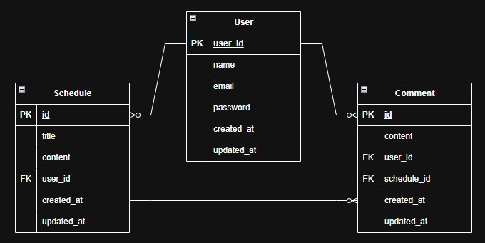

# 📅 일정 관리 앱 - Develope 프로젝트
이전의 [일정 관리 앱 프로젝트](https://github.com/TwoTechSide/Sparta-Quest-Schedule-App)에서 숙련된 난이도로 진행되는 프로젝트입니다.  
`CRUD` 관련, `Validation` 어노테이션 등 새롭게 학습한 내용을 적용하며 구현하였습니다.  

- - -

## 📌 학습 목표

- '**JPA 연관관계**'를 `단방향`으로 적용 (필요시 `양방향` 적용) 
- 인증/인가 절차는 `Cookie/Session`을 활용하여 개발
- 로그인이 된 유저에게 API를 사용할 수 있도록 `Filter` 적용
- `PasswordEncoder`를 통해 유저 비밀번호 암호화

- - -

## 📋 필수 기능 가이드

- **Lv 0. API 명세 및 ERD 작성**
  <details>
  <summary>접기/펼치기</summary>

    - **API 명세서 작성하기**
        - API명세서는 프로젝트 root(최상위) 경로의 `README.md` 에 작성
    - **ERD 작성하기**
        - ERD는 프로젝트 root(최상위) 경로의 `README.md` 에 첨부
  </details>
- **Lv 1. 일정 CRUD** [Issue #1](https://github.com/TwoTechSide/Sparta-Quest-Schedule-App2/issues/1)
  <details>
  <summary>접기/펼치기</summary>

  - 일정을 생성, 조회, 수정, 삭제할 수 있습니다.
  - 일정은 아래 필드를 가집니다.
      - `작성 유저명`, `할일 제목`, `할일 내용`, `작성일`, `수정일` 필드
      - `작성일`, `수정일` 필드는 `JPA Auditing`을 활용합니다.
  </details>
- **Lv 2. 유저 CRUD** [Issue #3](https://github.com/TwoTechSide/Sparta-Quest-Schedule-App2/issues/3)
  <details>
  <summary>접기/펼치기</summary>

  - 유저를 생성, 조회, 수정, 삭제할 수 있습니다.
  - 유저는 아래와 같은 필드를 가집니다.
      - `유저명`, `이메일`, `작성일` , `수정일` 필드
      - `작성일`, `수정일` 필드는 `JPA Auditing`을 활용합니다.
  - 연관관계 구현
      - 일정은 이제 `작성 유저명` 필드 대신 `유저 고유 식별자` 필드를 가집니다.
  </details>
- **Lv 3. 회원가입** [Issue #3](https://github.com/TwoTechSide/Sparta-Quest-Schedule-App2/issues/3)
  <details>
  <summary>접기/펼치기</summary>

    - 유저에 `비밀번호` 필드를 추가합니다.
      - 비밀번호 암호화는 도전 기능에서 수행합니다.
  </details>
- **Lv 4. 로그인(인증)** [Issue #8](https://github.com/TwoTechSide/Sparta-Quest-Schedule-App2/issues/8)
  <details>
  <summary>접기/펼치기</summary>

    - 키워드  
    **인터페이스**  
      - HttpServletRequest / HttpServletResponse : 각 HTTP 요청에서 주고받는 값들을 담고 있습니다.
  - **설명**
    - **Cookie/Session**을 활용해 로그인 기능을 구현합니다. → `Filter 활용!`
    - 필터를 활용해 인증 처리를 할 수 있습니다.
    - `@Configuration` 을 활용해 필터를 등록할 수 있습니다.
  - **조건**
    - `이메일`과 `비밀번호`를 활용해 로그인 기능을 구현합니다.
    - 회원가입, 로그인 요청은 인증 처리에서 제외합니다.
  - **예외처리**
    - 로그인 시 이메일과 비밀번호가 일치하지 않을 경우 HTTP Status code 401을 반환합니다.
  </details>

- - -

## 📚 도전 기능 가이드

- **Lv 5. 다양한 예외처리 적용하기** [Issue #11](https://github.com/TwoTechSide/Sparta-Quest-Schedule-App2/issues/11)
  <details>
  <summary>접기/펼치기</summary>

    - Validation을 활용해 다양한 예외처리를 적용합니다.
    - 정해진 예외처리 항목이 있는 것이 아닌 프로젝트를 분석하고 예외사항을 지정해 봅니다.
      - 예) 할일 제목은 10글자 이내, 유저명은 4글자 이내
  </details>
- **Lv 6. 비밀번호 암호화** [Issue #13](https://github.com/TwoTechSide/Sparta-Quest-Schedule-App2/issues/13)
  <details>
  <summary>접기/펼치기</summary>

    - Lv.3에서 추가한 `비밀번호` 필드에 들어가는 비밀번호를 암호화합니다.
      - 암호화를 위한 `PasswordEncoder`를 직접 만들어 사용합니다.
  </details>
- **Lv 7. 댓글 CRUD** [Issue #15](https://github.com/TwoTechSide/Sparta-Quest-Schedule-App2/issues/15)
  <details>
  <summary>접기/펼치기</summary>

    - 생성한 일정에 댓글을 남길 수 있습니다.
      - 댓글과 유저, 일정은 연관관계를 가집니다.
  - 댓글을 저장, 조회, 수정, 삭제할 수 있습니다.
  - 댓글은 아래와 같은 필드를 가집니다.
    - `댓글 내용`, `작성일`, `수정일`, `유저 고유 식별자`, `일정 고유 식별자` 필드
    - `작성일`, `수정일` 필드는 `JPA Auditing`을 활용하여 적용합니다.
  </details>
- **Lv 8. 일정 페이징 조회** [Issue #17](https://github.com/TwoTechSide/Sparta-Quest-Schedule-App2/issues/17)
  <details>
  <summary>접기/펼치기</summary>

  - 키워드  
    **데이터베이스**
      - offset / limit : SELECT 쿼리에 적용해서 데이터를 제한 범위에 맞게 조회할 수 있습니다.
  
    **페이징**
      - Pageable : Spring Data JPA에서 제공되는 페이징 관련 인터페이스 입니다.
      - PageRequest : Spring Data JPA에서 제공되는 페이지 요청 관련 클래스입니다.
    - 일정을 Spring Data JPA의 `Pageable`과 `Page` 인터페이스를 활용하여 페이지네이션을 구현
      - `페이지 번호`와 `페이지 크기`를 쿼리 파라미터로 전달하여 요청하는 항목을 나타냅니다.
      - `할일 제목`, `할일 내용`, `댓글 개수`, `일정 작성일`, `일정 수정일`, `일정 작성 유저명` 필드를 조회합니다.
      - 디폴트 `페이지 크기`는 10으로 적용합니다.
    - 일정의 `수정일`을 기준으로 내림차순 정렬합니다.
  </details>

- - -

## 🛠 사용 기술 및 도구

- **Language**: Java 17
- **JDK** : Amazon Corretto 17
- **Framework** : Spring Boot 3.5.4
- **IDE** : IntelliJ IDEA
- **Version Control** : Git
- **Dependences** : Lombok, Spring Web, JPA, MapStruct, Validation, BCrypt

- - -

## 📁 디렉토리 구조

```
com.scheduleapp2/
├── common/
│   ├── annotation
│   ├── config
│   ├── exception
│   └── filter
├── controller/
├── dto/
│   ├── comment/
│   ├── schedule/
│   └── user/ 
├── entity/
├── mapper/
├── repository/                     # Repository 계층
├── service/                        # Service 계층
└── ScheduleApp2Application.java    # 애플리케이션 시작 클래스
```

- - -

## 📄 ERD



- - -

## 📄 API 명세서

- **User API**

| Method | URL             | Description | Body                      |
|--------|-----------------|-------------|---------------------------|
| POST   | /users/signup   | 유저 생성(회원가입) | { name, email, password } |
| POST   | /users/login    | 유저 로그인      | { email, password }       |
| GET    | /users/logout   | 유저 로그인      | { email, password }       |
| GET    | /users/{userId} | 유저 조회       |                           |
| PATCH  | /users/{userId} | 유저 수정       | { name, email }           |
| DELETE | /users/{userId} | 유저 삭제       |                           |

- **Schedule API**

| Method | URL                         | Description | Body               |
|--------|-----------------------------|-------------|--------------------|
| POST   | /schedules                  | 일정 생성       | { title, content } |
| GET    | /schedules                  | 모든 일정 조회    |                    |
| GET    | /schedules/page?page=&size= | 일정 페이지 조회   |                    |
| PATCH  | /schedules/{scheduleId}     | 일정 수정       | { title, content } |
| DELETE | /schedules/{scheduleId}     | 일정 삭제       |                    |

- **Comment API**

| Method | URL                              | Description | Body                      |
|--------|----------------------------------|-------------|---------------------------|
| POST   | /comments/schedules/{scheduleId} | 댓글 생성       | { content }               |
| GET    | /comments/schedules/{scheduleId} | 일정 댓글 조회    |                           |
| GET    | /comments/users/{userId}         | 유저 댓글 생성    |                           |
| PATCH  | /comments/{commentId}            | 댓글 수정       | { content, userPassword } |
| DELETE | /comments/{commentId}            | 댓글 삭제       | { content }               |


## 📅 개발 기간

-  25.08.05 ~ 25.08.14 (총 9일)
